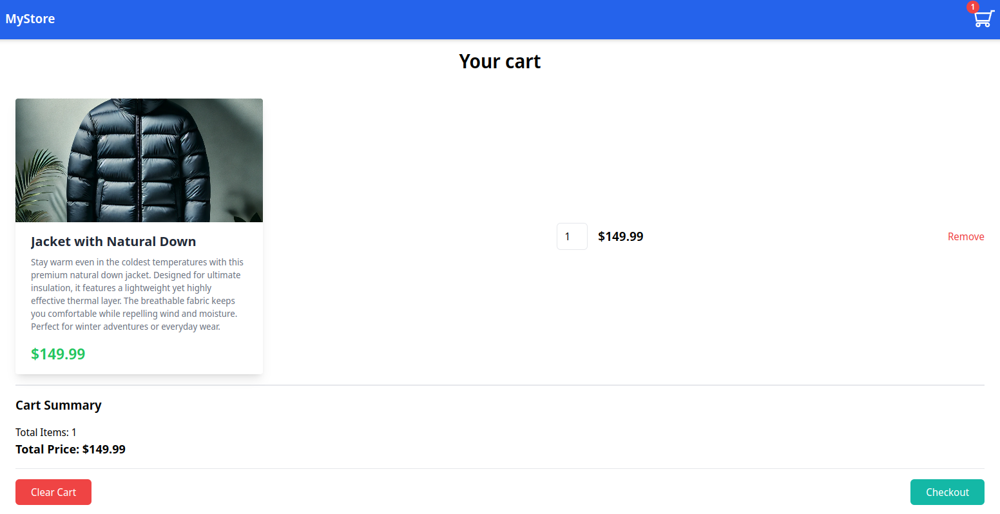
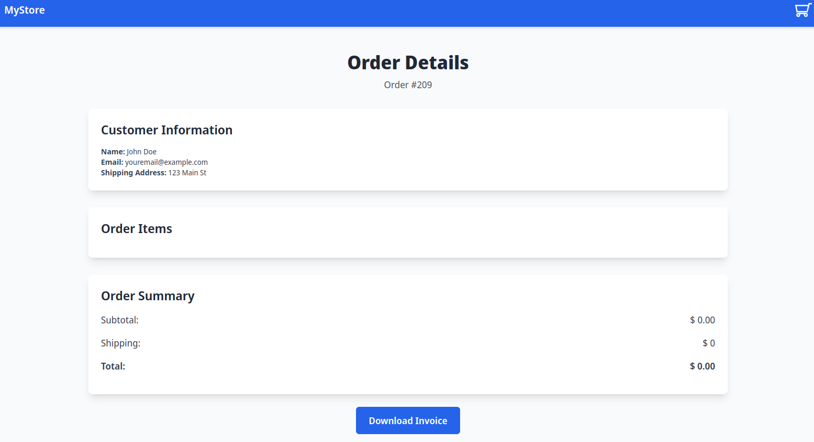

# E-commerce (Web)
by **Szczurowsky**

Difficulty: Medium

### 1. Analyze the website
The website is a simple e-commerce platform where you can add items to the cart and place an order.
You can see a couple screenshots of the website below (just so you can have a better idea of what it looks like):




Now, let's analyze how I found each of the flags.
I'll start with the second flag, then the first one, and finally the third one.
This is the order in which I found them, but that didn't really matter.
You simply needed to have all three flags to complete the challenge.

> **Note:** You can find all of my payloads in the `payloads` folder. It contains all Python script that I used to find the flags, however basic `curl` commands should be enough to reproduce the results.

### 2. The second flag
The second flag was very straight forward. As you can see in the last screenshot, each order has a unique ID.
The ID is used to fetch the order details.
However, there's no authentication and no form of determining if we're the same user as the one who made given purchase.
Therefore, we can access details of other orders simply by changing the ID in the link.
This is a classic case of Insecure Direct Object Reference (IDOR).
Accessing the order with `ID: 1` exposes the second flag for us!

***Flag 2:*** `flag{2_1t_w2s_my_0rd3r}`

### 3. The first flag
The first flag was a bit tricky. The website has a feature that allows you to check the availability of an item.
This feature is vulnerable to Server-Side Request Forgery (SSRF).
By sending a request to the server with a payload that instead points to the admin panel,
we can retrieve the first flag.

***Flag 1:*** `flag{1_y0u_ar3_adm1n_1nn1t}`

### 4. The third flag
The third flag was the most difficult to find. The website allows you to download a PDF file with the order details. However, the PDF file is generated using a library (**WeasyPrint 64.1** - we can find that out in the metadata of the file) that has a known vulnerability if the inputs aren't sanitized properly. You can find more information on that vulnerability here: 
> - [WeasyPrint Documentation - Security](https://doc.courtbouillon.org/weasyprint/stable/first_steps.html#security)
> - [WeasyPrint Documentation - Attaching Files](https://doc.courtbouillon.org/weasyprint/stable/common_use_cases.html#attach-files)

By exploiting this vulnerability, we can retrieve the third flag.
First, we need to add a link to `/etc/passwd` in the PDF file.
This will allow us to download the file along with the rest of the order details.
Inside that file, we can see very specific line:
```
flag_d0nt_r3ad_my_tmp_flag:x:1002:1002::/home/flag_d0nt_r3ad_my_tmp_flag:/bin/sh
```

It clearly indicates that it might be worth creating another PDF file in the same way
but this time checking the `/tmp/flag` file.
That file does indeed contain the flag we're looking for.

***Flag 3:*** `flag{3_y0u_d1d_1t!_n0w_H4CK_TH3_W0R1D}`

### 5. Final flag
The final flag is simply a combination of all three flags in the format `flag{1_...}_flag{2_...}_flag{3_...}`.

***Final flag:*** `flag{1_y0u_ar3_adm1n_1nn1t}_flag{2_1t_w2s_my_0rd3r}_flag{3_y0u_d1d_1t!_n0w_H4CK_TH3_W0R1D}`

### 6. Additional sources
Other than the links provided above, I'd also like to mention the following YouTube video
that helped me with pulling off the attack for the last flag:
> - [_Exploiting a Server Side Request Forgery (SSRF) in WeasyPrint to hack Lyft & HackerOne’s $50M CTF_ by **NahamSec**](https://www.youtube.com/watch?v=t5fB6OZsR6c)