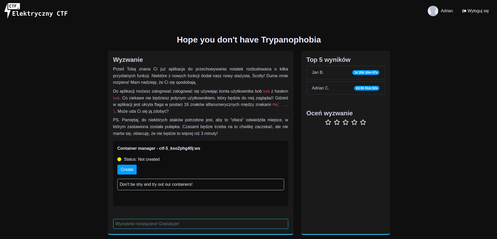

# PW_CTF_DS 2024-2025
Subdirectory containing my step-by-step solutions to CTF challenges served
as part of the "Data Security in IT systems"
course at Applied Computer Science faculty in Warsaw University of Technology.

### Used tools
* Visual Studio Code
* PyCharm (JetBrains)
* Binary Ninja
* fastcoll (https://github.com/brimstone/fastcoll.git)

### Achieving second place in the fifth challenge
